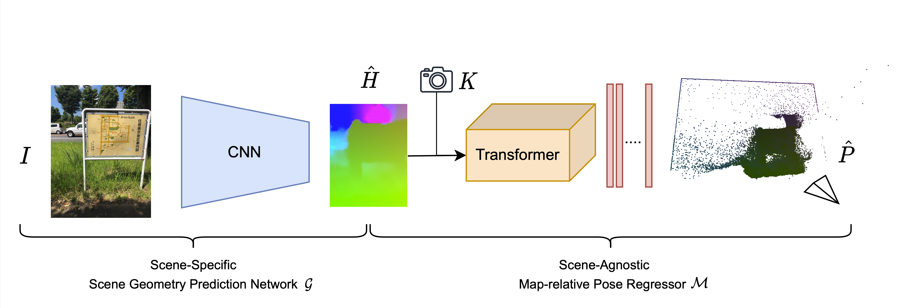

# Map-Relative Pose Regression for Visual Re-Localization

**[Shuai Chen](https://chenusc11.github.io/), [Tommaso Cavallari](https://scholar.google.com/citations?user=r7osSm0AAAAJ&hl=en), [Victor Adrian Prisacariu](https://www.robots.ox.ac.uk/~victor/), and [Eric Brachmann](https://ebrach.github.io/) (CVPR 2024 Highlight)**

**[Project page](https://nianticlabs.github.io/marepo/) | [Paper](https://arxiv.org/abs/2404.09884)**

[](https://nianticlabs.github.io/marepo/)

Table of contents:

- [Installation](#installation)
- [Dataset Setup](#datasets-setup)
- [Marepo Evaluation](#marepo-evaluation)
- [Marepo Training](#marepo-training)
  - [Training Data Preparation](#training-data-preparation)
    - [ACE Head Pre-training](#ace-head-pre-training)
  - [Train Marepo Pose Regressor](#train-marepo-pose-regressor)
  - [Fine-tune scene-specific Marepo_s](#fine-tune-scene-specific-marepos)
- [References](#publications)

## Installation

This code uses PyTorch to train and evaluate map-relative pose regression (**_marepo_**) networks. It has been tested
on Ubuntu 20.04 with V100 Nvidia GPUs, although it should reasonably run with other Linux distributions and GPUs as well.

We provide a pre-configured `conda` environment containing all required dependencies
necessary to run our code.
You can re-create and activate the environment with:

```shell
conda env create -f environment.yml
conda activate public_marepo
```

## Datasets Setup

The **_marepo_** method has been evaluated using multiple published datasets:

- [Niantic Wayspots](https://nianticlabs.github.io/ace#dataset)
- [Microsoft 7-Scenes](https://www.microsoft.com/en-us/research/project/rgb-d-dataset-7-scenes/)
- [Stanford 12-Scenes](https://graphics.stanford.edu/projects/reloc/)

We provide scripts in the `datasets` folder to automatically download and extract the data in a format that can be
readily used by the **_marepo_** scripts.
The format is the same used by the DSAC* codebase, see [here](https://github.com/vislearn/dsacstar#data-structure) for
details.

> **Important: make sure you have checked the license terms of each dataset before using it.**

### {7, 12}-Scenes:

You can use the `datasets/setup_{7,12}scenes.py` scripts to download the data. To download and prepare the datasets:

```shell
cd datasets
# Downloads the data to datasets/7scenes_{chess, fire, ...}
./setup_7scenes.py
# Downloads the data to datasets/12scenes_{apt1_kitchen, ...}
./setup_12scenes.py
```

### Niantic Wayspots:

We used Niantic Wayspots dataset using the AR-kit poses. Simply run:

```shell
cd datasets
# Downloads the data to datasets/wayspots_{bears, cubes, ...}
./setup_wayspots.py
```

## Marepo Evaluation

We provide scripts to train and evaluate marepo networks.

Before, running the test script, please make sure you have download the pre-trained ACE head models and marepo models from **below**
and save them in the `${REPO_PATH}/logs/` folder.

#### Pre-trained Models
| Model (Linked)                                                                                  | Description                                 | 
-------------------------------------------------------------------------------------------------|---------------------------------------------
| ACE Heads                                                                                       |                                             |
 [wayspots_pretrain](https://storage.googleapis.com/niantic-lon-static/research/marepo/wayspots_pretrain.zip) | Pre-trained ACE Heads, Wayspots |
 [pretrain](https://storage.googleapis.com/niantic-lon-static/research/marepo/pretrain.zip)      | Pre-trained ACE Heads, 7-Scenes & 12-Scenes |
| marepo models                                                                                   |                                             |
 [paper_model](https://storage.googleapis.com/niantic-lon-static/research/marepo/paper_model.zip) | marepo paper models   |

To run inference with **_marepo_** on a test scene, there should be three components:
- The ACE encoder (`ace_encoder_pretrained.pt`) that is pre-trained from the ACE paper and should be readily available in the repository by default.
- The ACE heads should be put in `logs/wayspots_pretrain/` or `logs/pretrain/`. We use the pre-trained ACE heads for the scene-specific coordinate prediction.
  To test on a new dataset, you can train the ACE head using the `train_ace.py` script, as in the [ACE](https://github.com/nianticlabs/ace) paper. (see [ACE Head Pre-training](#ace-head-pre-training) for details.)
- The marepo pose regression models should be put in `logs/paper_model/`.

Having done the steps above, you are ready to experiment with **_marepo_**!

The pose estimation for a testing scene can be performed using the `test_[dataset].sh` scripts.

```shell
cd scripts
# test wayspots
sh test_wayspots.sh
# test 7scenes
sh test_7scenes.sh
# test 12scenes
sh test_12scenes.sh
```

These scripts run the following command to test the **_marepo_** pre-trained model.
For example, for the Wayspots dataset:
```shell
for scene in ${DATASET_PATH_TEST}; do
  echo "${scene}" # whole path
  echo "${scene##*/}" # base file name
  ace_head_path="${REPO_PATH}/logs/mapfree/${datatype}/${scene##*/}/${scene##*/}.pt"
  python $testing_exe "${scene}" "$out_dir/${model_name}.pt" --head_network_path ${ace_head_path} \
  --transformer_json ../transformer/config/nerf_focal_12T1R_256_homo.json --load_scheme2_sc_map True \
  2>&1 | tee "$out_dir/log_Marepo_${scene##*/}_${datatype}.txt"
done
# Compute scene average stats
python $read_log_Marepo "Wayspots" "$out_dir" "${datatype}"
```

Or you can test the **_marepo_s_** pre-trained model:
```shell
for scene in ${DATASET_PATH_TEST}; do
  echo "${scene}" # whole path
  echo "${scene##*/}" # base file name
  ace_head_path="${REPO_PATH}/logs/mapfree/${datatype}/${scene##*/}/${scene##*/}.pt"
  marepo_head_path="${REPO_PATH}/logs/paper_model/marepo_s_${scene##*/}/marepo_s_${scene##*/}.pt"
  python $testing_exe "${scene}" "$marepo_head_path" --head_network_path ${ace_head_path} \
  --transformer_json ../transformer/config/nerf_focal_12T1R_256_homo.json --load_scheme2_sc_map True \
  2>&1 | tee "$out_dir/log_Finetune_Marepo_${scene##*/}_${datatype}.txt"
done
# Compute scene average stats
python $read_log_Marepo "Wayspots" "$out_dir" "${datatype}" --finetune True
````

## Marepo Training
Since our **_marepo_** model has already been pretrained and released, usually there is no need to train it again. 
However, we include the training method below for researchers who are interested in improving our method.

To train a **_marepo_** pose regression network from scratch, we recommend to use at least 8 V100 GPU, or equivalent hardware with similar or better amount of GPUs memory.
In addition, we also support flash attention in the transformer to train using 16-bit mixed precision (currently under beta-testing).

### Training Data Preparation
As described in the paper, we train our **_marepo_** pose regressor using the [map-free dataset](https://github.com/nianticlabs/map-free-reloc).
The dataset training set includes 460 outdoor scene scans that range mostly within ±20 meters from the origin.
Those are the scenes that we use to train the **_marepo_** model.
- Note: in our experience, storing the entire **_marepo_** training set after data augmentation (described in the following) will require at least 4TB of disk space.

#### Build the Map-Free training set for **_marepo_**


**Data splits**: As described in the paper:
- In our developement phase, we use seq. 0-199 and seq. 210-409 as the training set, and seq. 410-459 as the validation set. 
- For our final paper model, we use seq. 0-199 and seq. 210-459 to train the final model after fixing all hyperparameters.

We provide two ways to download the map-free dataset:
1. You can directly downloaded the unaugmented mapfree data from [here](https://storage.googleapis.com/niantic-lon-static/research/marepo/map_free_training_scenes.zip)
2. Or you can download the data from the [map-free official website](https://research.nianticlabs.com/mapfree-reloc-benchmark/dataset).

Then, you will need to manually create the `train/, val/, and test/` subfolders and move your data splits to the following structure:
```
map_free_training_scenes_aug_16/
├── train/
├──├──mapfree_s00000/
├──├──├──train/
├──├──├──├──rgb/
├──├──├──├──calibration/
├──├──├──├──poses/
├──├──├──test/
├──├──├──├──rgb/
├──├──├──├──calibration/
├──├──├──├──poses/
├──├──mapfree_s00001/
├──├──...
├──├──mapfree_s00199/
├──├──mapfree_s00210/
├──├──mapfree_s00211/
├──├──...
├──├──mapfree_s00409/
├── val/
├──├──mapfree_s00410/
├──├──mapfree_s00411/
├──├──...
├──├──mapfree_s00459/
├── test/
├──├──mapfree_s00200/
├──├──mapfree_s00201/
├──├──...
├──├──mapfree_s00209/
```

To prepare the training data, you will first train an ACE head for every single mapfree scene. 
We augmented our training data by also flipping the mapping and query sequences, therefore we train 450 additional ACE heads.

So, let's first flip the mapfree training dataset:
```shell
# go to the folder that contains map_free_training_scenes_aug_16/ and make a copy of it
cp -d -r map_free_training_scenes_aug_16/ map_free_training_scenes_aug_16_flip

# go to the preprocess_scripts folder and call the scripts that swaps the mapping and query sequences[train_mapfree.sh](scripts%2Ftrain_mapfree.sh)
# notice that we only flip the training and validation set, and keep the test set unchanged since it's not used in training.
cd ${REPO_PATH}/preprocess_scripts
sh flip_mapfree.sh
```

#### ACE Head Pre-training
Once the flipped dataset is prepared, we can (optionally) train the ACE heads for the mapfree dataset, as follows. 
Note: we release the pre-trained ACE heads here
- [mapfree](https://storage.googleapis.com/niantic-lon-static/research/marepo/mapfree.zip)
- [mapfree_flip](https://storage.googleapis.com/niantic-lon-static/research/marepo/mapfree_flip.zip)

if you don't want to train them yourself.

```shell
# This is the reference script to train the ACE head for mapfree dataset.
# You can run similar script to train ACE heads for other datasets as well.
cd ../scripts
# train ace head for mapfree dataset
sh train_mapfree.sh
```

Once the ACE heads are trained over the mapfree dataset, we are ready to generate the training data for the **_marepo_** pose regressor.
To do so, we will use the scripts in the `preprocess_scripts/` folder and `preprocess_marepo.py`.

#### Generating Training Data for Marepo
**So far so good!** Now, we can generate the training data for **_marepo_** pose regressor.
```shell
cd ../preprocess_scripts
sh create_mapfree_all_dataset.sh
````

**If you made it this far, congratulations!** You have successfully prepared the training data for **_marepo_** pose regressor.

### Train Marepo Pose Regressor
Now we can start training:

```shell
cd ../scripts
sh train_marepo.sh
```

### Fine-tune scene-specific **_marepo_s_**
We can optionally fine-tune the scene-specific **_marepo_s_** pose regressor.
In my implementation, I might only use 15 degrees for random rotation jittering instead of 180 degrees, which works less aggressively and is superior at finetuning.

```shell
# Generate Fine-tune dataset for wayspots and 7scenes
cd ../preprocess_scripts
sh create_wayspots_dataset.sh
sh create_7scenes_finetune_dataset.sh

# Fine-tune Marepo_s on Wayspots and 7scenes
cd ../scripts
sh train_marepo_s_wayspots.sh
sh train_marepo_s_7scenes.sh
````

## Publications

Please cite our paper and star this repo if you find our work helpful. Thanks!:

```
@inproceedings{chen2024marepo,
  title={Map-Relative Pose Regression for Visual Re-Localization},
  author={Chen, Shuai and Cavallari, Tommaso and Prisacariu, Victor Adrian and Brachmann, Eric},
  booktitle={CVPR},
  year={2024}
}
```

This code builds on previous camera relocalization pipelines, namely DSAC*, and ACE. Please consider citing:

```
@article{brachmann2021dsacstar,
  title={Visual Camera Re-Localization from {RGB} and {RGB-D} Images Using {DSAC}},
  author={Brachmann, Eric and Rother, Carsten},
  journal={TPAMI},
  year={2021}
}

@inproceedings{brachmann2023ace,
  title={Accelerated Coordinate Encoding: Learning to Relocalize in Minutes using RGB and Poses},
  author={Brachmann, Eric and Cavallari, Tommaso and Prisacariu, Victor Adrian},
  booktitle={CVPR},
  year={2023},
}
```

## License

Copyright © Niantic, Inc. 2024. Patent Pending.
All rights reserved.
Please see the [license file](LICENSE) for terms.
